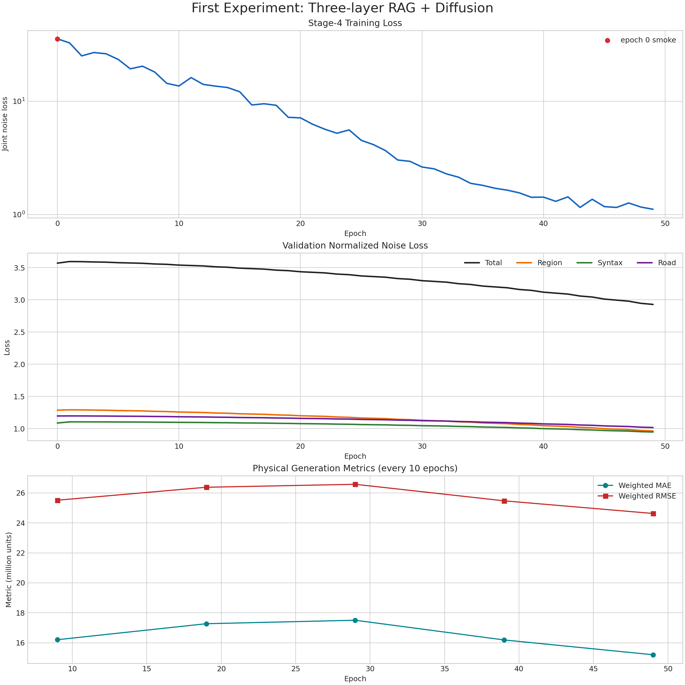

# 第一次实验：三层 RAG + Conditional Diffusion

记录日期：2026-09-21  
状态：已完成 50 个记录 epoch（`0–49`），最佳 checkpoint 位于 epoch 49。

> 注意：epoch 0 是单 snapshot smoke test，不是完整训练 epoch。正式三城训练从 epoch 1 开始，因此收敛率以 epoch 1 和 epoch 49 比较。

## 1. 实验配置

| 项目 | 设置 |
|---|---|
| Source cities | Beijing、Chengdushi、Xianshi |
| Train snapshots | 69（每城 23） |
| Eval snapshots | 18（每城 validation 3、test 3） |
| GPU | 5 × NVIDIA RTX 2080 Ti（约 11 GiB/卡） |
| Train diffusion steps | 500 |
| Validation sampling | DDIM 100 steps，eta=0 |
| Learning rate | 5e-6 |
| Node chunk size | 64 |
| Memory strategy | gradient checkpointing、CPU source cache、detached source keys |
| Distributed strategy | 5 rank city-bucket 分发，显式 gradient all-reduce/average |

## 2. Loss 结果

| 指标 | epoch 1 | epoch 49 | 降幅 | 最佳 epoch |
|---|---:|---:|---:|---:|
| Train joint noise loss | 32.668230 | 1.112925 | 96.59% | 49 |
| Validation total noise loss | 3.594939 | 2.929178 | 18.52% | 49 |
| Validation Region loss | 1.292012 | 0.964095 | 25.38% | 49 |
| Validation Syntax loss | 1.105361 | 0.947536 | 14.28% | 49 |
| Validation Road loss | 1.197567 | 1.017546 | 15.03% | 49 |

完整逐 epoch 数据见 [第一次实验_metrics.csv](第一次实验_metrics.csv)。

## 3. 物理生成指标

| Epoch | Weighted MAE | Weighted RMSE |
|---:|---:|---:|
| 9 | 16,203,722.07 | 25,515,614.86 |
| 19 | 17,270,365.93 | 26,381,079.76 |
| 29 | 17,503,216.67 | 26,579,125.41 |
| 39 | 16,187,223.70 | 25,475,402.44 |
| 49 | 15,199,352.99 | 24,630,819.11 |

epoch 49 分层结果：

| 层 | MAE | RMSE |
|---|---:|---:|
| Region | 43,868,712.00 | 70,019,368.00 |
| Syntax | 4,016.47 | 7,123.09 |
| Road | 1,725,330.50 | 3,865,966.25 |
| 三层加权 | 15,199,352.99 | 24,630,819.11 |

## 4. 关键观察

- 正式训练 loss 从 32.6682 降至 1.1129，下降 96.59%，优化过程有效。
- Validation total loss 从 3.5949 降至 2.9292，epoch 49 仍在改善，尚未出现明确平台期。
- Train/validation loss 差距较大，可能存在过拟合、跨城市泛化差距或训练/验证噪声任务难度差异。
- `top_k=5` 时最终 RAG top-1 weight 为 0.200149，接近均匀权重 0.2，说明当前检索区分度偏弱。
- 物理空间指标在 epoch 19/29 曾反弹，epoch 49 达到本轮最低加权 MAE/RMSE，但绝对值仍很高，不能作为成熟生成结果。
- 继续增加 epoch 前，建议优先审计 Region normalizer 反变换、三层指标量纲和 RAG 检索权重；确认无尺度问题后再扩展到 75/100 epoch。

## 5. 运行事件与修复

- 初始 Road U-Net 在 11 GiB GPU 上 OOM；通过 `node_chunk_size=64`、gradient checkpointing、CPU source cache 修复。
- 第 10 个 epoch 的 500-step DDPM 物理生成曾出现非有限 epsilon；验证采样改为 DDIM 100 steps，并增加 sampling-only `x0` clip=8.0。
- 训练 loss 的 NaN/Inf 严格检查保持不变；物理生成异常会记录而不再终止训练。
- 修复后 epoch 9、19、29、39、49 的物理生成均成功完成。

## 6. GitHub 实验产物

原始 `.log` 合计仅 50.3 KiB，因此与清洁后的分析结果一并提交：

- 本报告；
- Loss/生成指标趋势图；
- 完整逐 epoch CSV；
- [完整结构化 history](logs/stage4_history.json)；
- [epoch 1–8 与首次生成失败日志](logs/train_5gpu.log)；
- [epoch 9 修复验证日志](logs/retry_epoch9.log)；
- [tmux 历史输出](logs/train_5gpu_tmux_history.log)；
- [epoch 12–49 实时日志](logs/train_5gpu_live.log)。

`best.pt` 和 `last.pt` 各约 279 MB，继续由 `.gitignore` 排除，不上传 GitHub。
